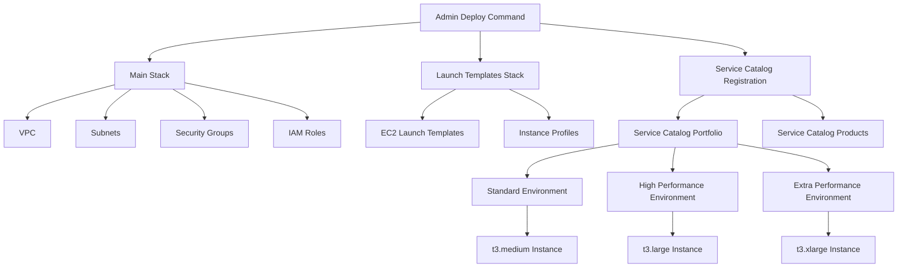

# AWS Agent Environment Tool

A command-line tool for setting up and managing cloud environments (EC2 instances) for agents that can connect through VSCode.

## Purpose

This tool provides a streamlined way to:

1. Set up the necessary AWS infrastructure for agent working environments
2. Launch and manage EC2 instances configured for agents to work efficiently
3. Connect to these environments through VSCode
4. Manage the lifecycle of agent environments

## Folder Structure

```
onboarding/
├── application/     # Python CLI application code
├── infrastructure/  # CloudFormation templates for AWS infrastructure
│   ├── initial/     # Base infrastructure templates
│   └── template/    # Launch templates and service catalog configurations
├── .venv/           # Python virtual environment (created by uv)
├── pyproject.toml   # Python project configuration
└── README.md        # This file
```

## How to Use the Tool

### Prerequisites

- AWS CLI configured with appropriate credentials
- Python 3.12 or higher
- uv package manager

### How to Initialize the Environment

As an administrator, you need to set up the base infrastructure before agents can launch their working environments:

1. Install the required dependencies:

```bash
uv add boto3 click
```

2. Deploy the infrastructure:

```bash
python -m application.cli admin deploy [--region REGION]
```

#### Infrastructure Deployment Details

The deployment process creates several CloudFormation stacks that set up the complete environment:



The deployment creates:

1. **Main Stack (DevEnvironment-Admin-Setup)**
   - VPC with public and private subnets
   - Internet Gateway and NAT Gateway
   - Security Groups for SSH and development access
   - IAM Roles for EC2 instances with SSM access

2. **Launch Templates Stack (DevEnvironment-Launch-Templates)**
   - EC2 Launch Templates for different instance types
   - Instance Profiles with appropriate permissions
   - User data scripts for environment setup

3. **Service Catalog Registration (DevEnvironment-Service-Catalog-Registration)**
   - Service Catalog Portfolio for development environments
   - Products for different environment sizes:
     - Standard: 4GB RAM, 2 vCPU (t3.medium)
     - High Performance: 8GB RAM, 2 vCPU (t3.large)
     - Extra Performance: 16GB RAM, 4 vCPU (t3.xlarge)

### How to Launch Environment and Connect Through VSCode

As an agent, you can launch your working environment:

1. Launch a new environment:

```bash
python -m application.cli developer launch [--region REGION] [--type standard|high|extra]
```

2. Check the status of your environment:

```bash
python -m application.cli developer status --name YOUR_ENVIRONMENT_NAME
```

3. Once the environment is ready, get the connection details:

```bash
python -m application.cli developer outputs --name YOUR_ENVIRONMENT_NAME
```

4. Connect to your environment through VSCode:
   - Install the "Remote - SSH" extension in VSCode
   - Use the connection details from the previous step to configure a new SSH host
   - Connect to the host through the Remote Explorer in VSCode

5. When you're done, terminate your environment:

```bash
python -m application.cli developer terminate --name YOUR_ENVIRONMENT_NAME
```

### Additional Commands

List all your provisioned environments:

```bash
python -m application.cli developer list [--region REGION]
```

## How to Contribute

1. Fork the repository
2. Create a feature branch (`git checkout -b feature/amazing-feature`)
3. Make your changes
4. Commit your changes (`git commit -m 'Add some amazing feature'`)
5. Push to the branch (`git push origin feature/amazing-feature`)
6. Open a Pull Request

### Development Guidelines

- Use type hints for all Python code
- Follow PEP 8 style guidelines
- Write unit tests for new functionality
- Update documentation as needed

## License

This project is licensed under the terms of the license included in the [LICENSE](LICENSE) file.
